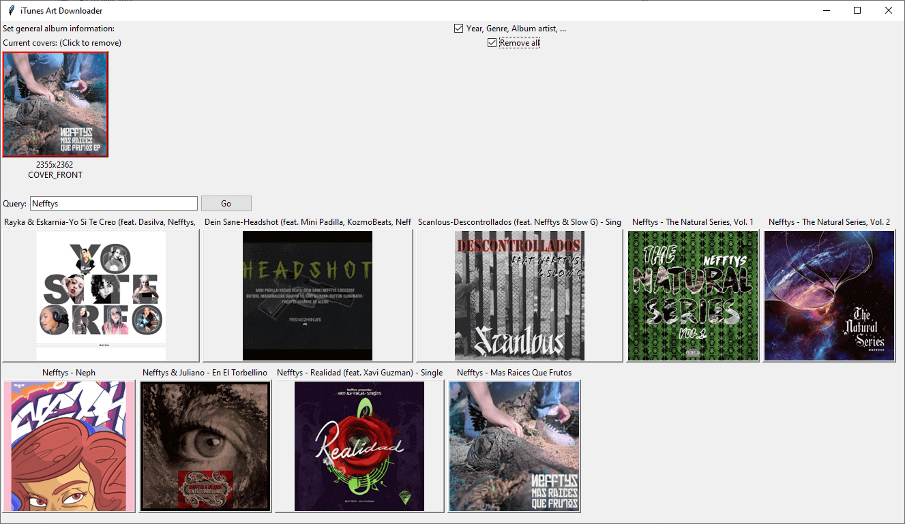

# py_itunesart
Download album cover and meta data information from [Apple iTunes API](https://web.archive.org/web/20220206024724/https://affiliate.itunes.apple.com/resources/documentation/itunes-store-web-service-search-api/).

Metadata and album cover can be stored in mp3 metadata/id3 and in m4a metadata

Can be used from the command line or from [Mp3Tag](http://www.mp3tag.de)

Requirements:
 * Python 3
 * [Mutagen](https://bitbucket.org/lazka/mutagen) python module `pip install mutagen`
 * [Pillow](https://pypi.org/project/Pillow/)/PIL python module `pip install pillow` (only required for the GUI) 

# Mp3Tag

To add it to the Mp3Tag context menu, do the following steps in Mp3Tag:

## Metadata from iTunes (Single song)
 * Open Tools -> Options -> Tools
 * Click on the "New" icon
 * Enter the name that shall appear in the context menu
 * For path choose your python.exe
 * For parameter use: `C:\pathtofile\download_itunes_meta_single.py -c -w -s "%_path%"`
 * Accept the "for all selected files" option

## Metadata from iTunes (Album/Folder)
 * Open Tools -> Options -> Tools
 * Click on the "New" icon
 * Enter the name that shall appear in the context menu
 * For path choose your python.exe
 * For parameter use: `C:\pathtofile\download_itunes_meta.py -c -w -s`
 * Uncheck the "for all selected files" option

## Only cover from iTunes (Single song)
 * Open Tools -> Options -> Tools
 * Click on the "New" icon
 * Enter the name that shall appear in the context menu
 * For path choose your python.exe
 * For parameter use: `C:\pathtofile\gui.py "%_path%"`
 * Or use: `C:\pathtofile\gui.py -r "%_path%"` if you want to remove all existing coverart
 * Uncheck the "for all selected files" option

## Only cover from iTunes (Album/Folder)
 * Open Tools -> Options -> Tools
 * Click on the "New" icon
 * Enter the name that shall appear in the context menu
 * For path choose your python.exe
 * For parameter use: `C:\pathtofile\gui.py -a "%_path%"`
 * Or use: `C:\pathtofile\gui.py -a -r "%_path%"` if you want to remove all existing coverart
 * Uncheck the "for all selected files" option

# GUI
tkinter GUI screenshot:

